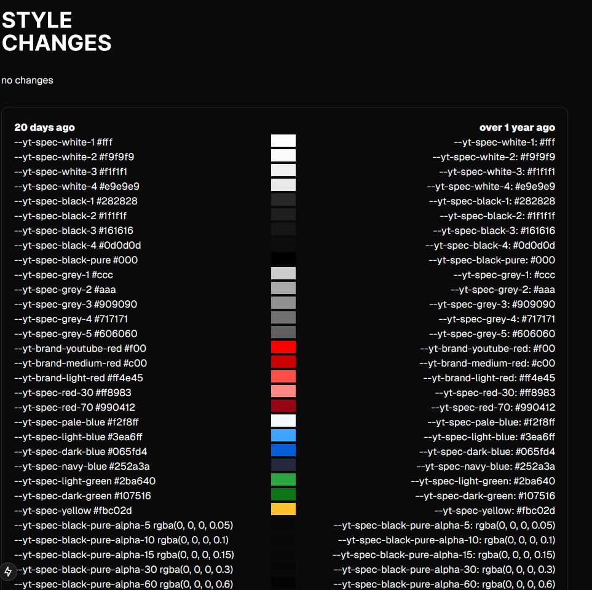

## style changes

This repo should help visualize changes between two strings of css variables of colors, this was made as a reference for [this add-on](https://github.com/GREEB/fix-pink-youtube) 

### TODO
- Get a bunch of snapshots as soon as archive api is back
- Create ui to compare different snapshots
- Mockup ui to show changes on logo and buttons